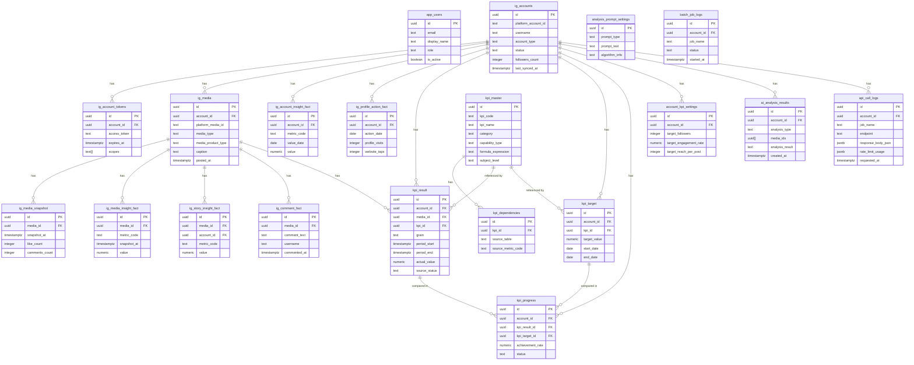

# Instagram分析システム ER図・テーブル定義書

**バージョン**: 1.0
**作成日**: 2026-04-03
**技術スタック**: Next.js / Supabase (PostgreSQL) / Vercel

---

## 1. アーキテクチャ概要

```
Instagram Graph API
        ↓
  Collector Batch（Supabase Edge Functions + pg_cron）
        ↓
  Raw Snapshot Storage（api_call_logs）
        ↓
  Normalized Fact Tables（ig_* テーブル群）
        ↓
  KPI Calculation Engine（kpi_calc_batch）
        ↓
  KPI Results（kpi_result）
        ↓
  Targets / Progress / Alerts（kpi_target / kpi_progress）
        ↓
  Next.js フロントエンド（Vercel）

※ Webhook は右横に後から差し込み可能な構造
```

---

## 2. テーブル一覧

| カテゴリ | テーブル名 | 説明 |
|---------|-----------|------|
| 認証・ユーザー | `app_users` | アプリログインユーザー |
| アカウント管理 | `ig_accounts` | Instagramアカウントマスタ |
| アカウント管理 | `ig_account_tokens` | アクセストークン管理 |
| Raw層 | `api_call_logs` | APIレスポンス原本保存 |
| Fact層 | `ig_media` | 投稿マスタ |
| Fact層 | `ig_media_snapshot` | 投稿スナップショット（時系列） |
| Fact層 | `ig_account_insight_fact` | アカウントInsight事実テーブル |
| Fact層 | `ig_media_insight_fact` | 投稿Insight事実テーブル |
| Fact層 | `ig_story_insight_fact` | ストーリーInsight事実テーブル |
| Fact層 | `ig_profile_action_fact` | プロフィールアクション事実テーブル |
| Fact層 | `ig_comment_fact` | コメント事実テーブル |
| KPI | `kpi_master` | KPI定義マスタ |
| KPI | `kpi_dependencies` | KPI依存関係マスタ |
| KPI | `kpi_result` | KPI計算結果 |
| KPI | `kpi_target` | KPI目標値 |
| KPI | `kpi_progress` | KPI進捗比較結果 |
| 設定 | `account_kpi_settings` | アカウント別KPI設定 |
| 設定 | `analysis_prompt_settings` | AI分析プロンプト設定 |
| 設定 | `account_strategy_settings` | アカウント戦略テキスト設定 |
| AI分析 | `ai_analysis_results` | AI分析結果保存 |
| バッチ管理 | `batch_job_logs` | バッチ実行ログ |
| バッチ管理 | `batch_job_schedules` | バッチスケジュール管理 |

---

## 3. テーブル詳細定義

---

### 3.1 認証・ユーザー管理

#### `app_users` — アプリログインユーザー

```sql
CREATE TABLE app_users (
  id            UUID PRIMARY KEY DEFAULT gen_random_uuid(),
  email         TEXT NOT NULL UNIQUE,
  display_name  TEXT,
  role          TEXT NOT NULL DEFAULT 'viewer',  -- 'admin' | 'editor' | 'viewer'
  is_active     BOOLEAN NOT NULL DEFAULT true,
  last_login_at TIMESTAMPTZ,
  created_at    TIMESTAMPTZ NOT NULL DEFAULT now(),
  updated_at    TIMESTAMPTZ NOT NULL DEFAULT now()
);
```

| カラム | 型 | 説明 |
|--------|-----|------|
| id | UUID | PK |
| email | TEXT | Supabase Auth と連携 |
| display_name | TEXT | 表示名 |
| role | TEXT | admin / editor / viewer |
| is_active | BOOLEAN | 有効フラグ |
| last_login_at | TIMESTAMPTZ | 最終ログイン日時 |

---

### 3.2 アカウント管理

#### `ig_accounts` — Instagramアカウントマスタ

```sql
CREATE TABLE ig_accounts (
  id                   UUID PRIMARY KEY DEFAULT gen_random_uuid(),
  platform_account_id  TEXT NOT NULL UNIQUE,   -- InstagramビジネスアカウントID
  facebook_page_id     TEXT,                    -- 連携FacebookページID
  username             TEXT NOT NULL,
  account_name         TEXT,
  account_type         TEXT NOT NULL,           -- 'BUSINESS' | 'CREATOR'
  biography            TEXT,
  profile_picture_url  TEXT,
  website              TEXT,
  followers_count      INTEGER,
  follows_count        INTEGER,
  media_count          INTEGER,
  status               TEXT NOT NULL DEFAULT 'active',  -- 'active' | 'paused' | 'disconnected'
  display_order        INTEGER NOT NULL DEFAULT 0,
  connected_at         TIMESTAMPTZ NOT NULL DEFAULT now(),
  last_synced_at       TIMESTAMPTZ,
  created_at           TIMESTAMPTZ NOT NULL DEFAULT now(),
  updated_at           TIMESTAMPTZ NOT NULL DEFAULT now()
);
```

#### `ig_account_tokens` — アクセストークン管理

```sql
CREATE TABLE ig_account_tokens (
  id                UUID PRIMARY KEY DEFAULT gen_random_uuid(),
  account_id        UUID NOT NULL REFERENCES ig_accounts(id) ON DELETE CASCADE,
  token_type        TEXT NOT NULL DEFAULT 'long_lived',  -- 'short_lived' | 'long_lived'
  access_token      TEXT NOT NULL,                        -- 暗号化して保存推奨
  expires_at        TIMESTAMPTZ,
  scopes            TEXT[],                               -- 付与スコープ一覧
  is_active         BOOLEAN NOT NULL DEFAULT true,
  last_verified_at  TIMESTAMPTZ,
  created_at        TIMESTAMPTZ NOT NULL DEFAULT now(),
  updated_at        TIMESTAMPTZ NOT NULL DEFAULT now()
);
```

---

### 3.3 Raw層

#### `api_call_logs` — APIレスポンス原本保存

```sql
CREATE TABLE api_call_logs (
  id                    UUID PRIMARY KEY DEFAULT gen_random_uuid(),
  account_id            UUID REFERENCES ig_accounts(id),
  job_name              TEXT NOT NULL,              -- バッチ名
  endpoint              TEXT NOT NULL,              -- 呼び出したAPIエンドポイント
  request_params_json   JSONB,                      -- リクエストパラメータ
  response_status       INTEGER,                    -- HTTPステータスコード
  response_headers_json JSONB,                      -- レスポンスヘッダ（X-App-Usage含む）
  response_body_json    JSONB,                      -- レスポンスボディ原本
  rate_limit_usage      JSONB,                      -- X-App-Usage の値
  requested_at          TIMESTAMPTZ NOT NULL,
  finished_at           TIMESTAMPTZ,
  duration_ms           INTEGER,                    -- 処理時間（ミリ秒）
  retry_count           INTEGER NOT NULL DEFAULT 0,
  error_message         TEXT,
  created_at            TIMESTAMPTZ NOT NULL DEFAULT now()
);

-- インデックス
CREATE INDEX idx_api_call_logs_account_id ON api_call_logs(account_id);
CREATE INDEX idx_api_call_logs_job_name ON api_call_logs(job_name);
CREATE INDEX idx_api_call_logs_requested_at ON api_call_logs(requested_at DESC);
```

---

### 3.4 Normalized Fact層

#### `ig_media` — 投稿マスタ

```sql
CREATE TABLE ig_media (
  id                  UUID PRIMARY KEY DEFAULT gen_random_uuid(),
  account_id          UUID NOT NULL REFERENCES ig_accounts(id) ON DELETE CASCADE,
  platform_media_id   TEXT NOT NULL UNIQUE,         -- InstagramメディアID
  media_type          TEXT NOT NULL,                -- 'IMAGE' | 'VIDEO' | 'CAROUSEL_ALBUM'
  media_product_type  TEXT,                         -- 'FEED' | 'REELS' | 'STORY' | 'AD'
  caption             TEXT,
  permalink           TEXT,
  thumbnail_url       TEXT,                         -- 動画サムネイル
  media_url           TEXT,                         -- メインメディアURL
  children_json       JSONB,                        -- カルーセル子メディア情報
  posted_at           TIMESTAMPTZ NOT NULL,
  is_deleted          BOOLEAN NOT NULL DEFAULT false,
  is_comment_enabled  BOOLEAN,
  shortcode           TEXT,
  inserted_at         TIMESTAMPTZ NOT NULL DEFAULT now(),
  updated_at          TIMESTAMPTZ NOT NULL DEFAULT now()
);

-- インデックス
CREATE INDEX idx_ig_media_account_id ON ig_media(account_id);
CREATE INDEX idx_ig_media_posted_at ON ig_media(posted_at DESC);
CREATE INDEX idx_ig_media_media_product_type ON ig_media(media_product_type);
```

#### `ig_media_snapshot` — 投稿スナップショット（時系列）

```sql
CREATE TABLE ig_media_snapshot (
  id            UUID PRIMARY KEY DEFAULT gen_random_uuid(),
  media_id      UUID NOT NULL REFERENCES ig_media(id) ON DELETE CASCADE,
  snapshot_at   TIMESTAMPTZ NOT NULL,
  like_count    INTEGER,
  comments_count INTEGER,
  raw_json      JSONB,                              -- APIレスポンス原本
  created_at    TIMESTAMPTZ NOT NULL DEFAULT now()
);

-- インデックス
CREATE INDEX idx_ig_media_snapshot_media_id ON ig_media_snapshot(media_id);
CREATE INDEX idx_ig_media_snapshot_snapshot_at ON ig_media_snapshot(snapshot_at DESC);

-- ユニーク制約（同一投稿の同一時刻は1件のみ）
CREATE UNIQUE INDEX idx_ig_media_snapshot_unique ON ig_media_snapshot(media_id, snapshot_at);
```

#### `ig_account_insight_fact` — アカウントInsight事実テーブル

```sql
CREATE TABLE ig_account_insight_fact (
  id             UUID PRIMARY KEY DEFAULT gen_random_uuid(),
  account_id     UUID NOT NULL REFERENCES ig_accounts(id) ON DELETE CASCADE,
  metric_code    TEXT NOT NULL,    -- 'impressions' | 'reach' | 'profile_views' など
  dimension_code TEXT,             -- 'age' | 'gender' | 'city' | null（ディメンション別）
  dimension_value TEXT,            -- 'M' | '25-34' | 'Tokyo' など
  period_code    TEXT NOT NULL,    -- 'day' | 'week' | 'month' | 'lifetime'
  value_date     DATE NOT NULL,    -- 対象日付
  value          NUMERIC,          -- 指標値（NULLは未取得）
  fetched_at     TIMESTAMPTZ NOT NULL DEFAULT now()
);

-- インデックス
CREATE INDEX idx_ig_account_insight_fact_account_metric ON ig_account_insight_fact(account_id, metric_code);
CREATE INDEX idx_ig_account_insight_fact_value_date ON ig_account_insight_fact(value_date DESC);

-- ユニーク制約
CREATE UNIQUE INDEX idx_ig_account_insight_fact_unique
  ON ig_account_insight_fact(account_id, metric_code, dimension_code, dimension_value, period_code, value_date);
```

**主要 metric_code 一覧（アカウント）:**

| metric_code | 説明 | period |
|-------------|------|--------|
| impressions | インプレッション数 | day / week / month |
| reach | リーチ数 | day / week / month |
| profile_views | プロフィール閲覧数 | day |
| website_clicks | ウェブサイトクリック数 | day |
| follower_count | フォロワー数スナップショット | day |
| online_followers | オンラインフォロワー分布 | day |

#### `ig_media_insight_fact` — 投稿Insight事実テーブル

```sql
CREATE TABLE ig_media_insight_fact (
  id           UUID PRIMARY KEY DEFAULT gen_random_uuid(),
  media_id     UUID NOT NULL REFERENCES ig_media(id) ON DELETE CASCADE,
  metric_code  TEXT NOT NULL,
  period_code  TEXT NOT NULL DEFAULT 'lifetime',
  snapshot_at  TIMESTAMPTZ NOT NULL,
  value        NUMERIC,
  created_at   TIMESTAMPTZ NOT NULL DEFAULT now()
);

-- インデックス
CREATE INDEX idx_ig_media_insight_fact_media_metric ON ig_media_insight_fact(media_id, metric_code);
CREATE INDEX idx_ig_media_insight_fact_snapshot_at ON ig_media_insight_fact(snapshot_at DESC);

-- ユニーク制約
CREATE UNIQUE INDEX idx_ig_media_insight_fact_unique
  ON ig_media_insight_fact(media_id, metric_code, period_code, snapshot_at);
```

**主要 metric_code 一覧（投稿）:**

| metric_code | 説明 | 対象メディア |
|-------------|------|-------------|
| impressions | インプレッション数 | FEED / REELS |
| reach | リーチ数 | FEED / REELS |
| likes | いいね数 | FEED / REELS |
| comments | コメント数 | FEED / REELS |
| shares | シェア数 | FEED / REELS |
| saved | 保存数 | FEED / REELS |
| video_views | 動画再生数 | VIDEO / REELS |
| plays | 再生数（Reels） | REELS |
| ig_reels_aggregated_all_plays_count | Reels総再生数 | REELS |
| total_interactions | 総インタラクション数 | FEED / REELS |
| profile_visits | プロフィール訪問数 | FEED |
| follows | フォロー数（この投稿経由） | FEED |

#### `ig_story_insight_fact` — ストーリーInsight事実テーブル

```sql
CREATE TABLE ig_story_insight_fact (
  id           UUID PRIMARY KEY DEFAULT gen_random_uuid(),
  media_id     UUID NOT NULL REFERENCES ig_media(id) ON DELETE CASCADE,
  account_id   UUID NOT NULL REFERENCES ig_accounts(id) ON DELETE CASCADE,
  metric_code  TEXT NOT NULL,
  snapshot_at  TIMESTAMPTZ NOT NULL,
  value        NUMERIC,
  created_at   TIMESTAMPTZ NOT NULL DEFAULT now()
);

-- インデックス
CREATE INDEX idx_ig_story_insight_fact_media_id ON ig_story_insight_fact(media_id);
CREATE INDEX idx_ig_story_insight_fact_snapshot_at ON ig_story_insight_fact(snapshot_at DESC);
```

#### `ig_profile_action_fact` — プロフィールアクション事実テーブル

```sql
CREATE TABLE ig_profile_action_fact (
  id              UUID PRIMARY KEY DEFAULT gen_random_uuid(),
  account_id      UUID NOT NULL REFERENCES ig_accounts(id) ON DELETE CASCADE,
  action_date     DATE NOT NULL,
  profile_visits  INTEGER,
  website_taps    INTEGER,
  contact_taps    INTEGER,
  direction_taps  INTEGER,
  text_taps       INTEGER,
  call_taps       INTEGER,
  created_at      TIMESTAMPTZ NOT NULL DEFAULT now()
);

CREATE UNIQUE INDEX idx_ig_profile_action_fact_unique ON ig_profile_action_fact(account_id, action_date);
```

#### `ig_comment_fact` — コメント事実テーブル

```sql
CREATE TABLE ig_comment_fact (
  id                  UUID PRIMARY KEY DEFAULT gen_random_uuid(),
  media_id            UUID NOT NULL REFERENCES ig_media(id) ON DELETE CASCADE,
  platform_comment_id TEXT NOT NULL UNIQUE,
  parent_comment_id   TEXT,                  -- 返信コメントの場合
  comment_text        TEXT,
  username            TEXT,
  commented_at        TIMESTAMPTZ,
  hidden              BOOLEAN DEFAULT false,
  like_count          INTEGER DEFAULT 0,
  created_at          TIMESTAMPTZ NOT NULL DEFAULT now(),
  updated_at          TIMESTAMPTZ NOT NULL DEFAULT now()
);

CREATE INDEX idx_ig_comment_fact_media_id ON ig_comment_fact(media_id);
CREATE INDEX idx_ig_comment_fact_commented_at ON ig_comment_fact(commented_at DESC);
```

---

### 3.5 KPI管理

#### `kpi_master` — KPI定義マスタ

```sql
CREATE TABLE kpi_master (
  id                   UUID PRIMARY KEY DEFAULT gen_random_uuid(),
  kpi_code             TEXT NOT NULL UNIQUE,
  kpi_name             TEXT NOT NULL,
  kpi_name_en          TEXT,
  category             TEXT NOT NULL,         -- 'engagement' | 'reach' | 'growth' | 'content' | 'conversion'
  phase                TEXT NOT NULL DEFAULT 'phase1',
  subject_level        TEXT NOT NULL,         -- 'media' | 'account_daily' | 'account_weekly' | 'account_monthly'
  media_scope          TEXT,                  -- 'FEED' | 'REELS' | 'STORY' | 'ALL' | null
  capability_type      TEXT NOT NULL,         -- 'DIRECT_API' | 'DERIVED' | 'MANUAL_INPUT' | 'UNAVAILABLE_NOW'
  formula_type         TEXT,                  -- 'ratio' | 'delta' | 'sum' | 'avg' | 'custom'
  numerator_source     TEXT,                  -- 算出式: 分子のmetric_code
  denominator_source   TEXT,                  -- 算出式: 分母のmetric_code
  formula_expression   TEXT,                  -- 算出式（テキスト表現）
  default_grain        TEXT NOT NULL DEFAULT 'daily',  -- 'hourly' | 'daily' | 'weekly' | 'monthly'
  unit_type            TEXT NOT NULL,         -- 'count' | 'rate' | 'percent' | 'index'
  higher_is_better     BOOLEAN NOT NULL DEFAULT true,
  description          TEXT,
  is_active            BOOLEAN NOT NULL DEFAULT true,
  display_order        INTEGER NOT NULL DEFAULT 0,
  created_at           TIMESTAMPTZ NOT NULL DEFAULT now(),
  updated_at           TIMESTAMPTZ NOT NULL DEFAULT now()
);
```

**KPIマスタ初期データ（主要KPI一覧）:**

| kpi_code | kpi_name | category | capability_type | formula |
|----------|---------|---------|----------------|---------|
| reach_per_post | 投稿リーチ数 | reach | DIRECT_API | reach |
| impressions_per_post | 投稿インプレッション数 | reach | DIRECT_API | impressions |
| likes_per_post | いいね数 | engagement | DIRECT_API | likes |
| comments_per_post | コメント数 | engagement | DIRECT_API | comments |
| saves_per_post | 保存数 | engagement | DIRECT_API | saved |
| shares_per_post | シェア数 | engagement | DIRECT_API | shares |
| engagement_rate | エンゲージメント率 | engagement | DERIVED | (likes+comments+saves+shares) / reach |
| save_rate | 保存率 | engagement | DERIVED | saved / reach |
| share_rate | シェア率 | engagement | DERIVED | shares / reach |
| comment_rate | コメント率 | engagement | DERIVED | comments / reach |
| profile_visit_rate | プロフィール訪問率 | conversion | DERIVED | profile_visits / reach |
| follow_conversion_rate | フォロー転換率 | growth | DERIVED | follows / reach |
| follower_count | フォロワー数 | growth | DIRECT_API | follower_count |
| follower_growth_rate | フォロワー増加率 | growth | DERIVED | (current - prev) / prev |
| monthly_follower_gain | 月間フォロワー純増数 | growth | DERIVED | sum(daily_gain) |
| post_frequency_weekly | 週間投稿頻度 | content | DERIVED | count(posts) / weeks |
| early_velocity_index | 初速指数（投稿後1h） | content | DERIVED | reach_1h / avg_reach_1h |
| non_follower_reach_rate | 非フォロワー到達率 | reach | DIRECT_API | non_follower_reach / reach |
| video_view_rate | 動画視聴率 | engagement | DERIVED | video_views / impressions |
| kpi_achievement_rate | KPI達成率 | conversion | DERIVED | actual / target |

#### `kpi_dependencies` — KPI依存関係マスタ

```sql
CREATE TABLE kpi_dependencies (
  id                UUID PRIMARY KEY DEFAULT gen_random_uuid(),
  kpi_id            UUID NOT NULL REFERENCES kpi_master(id) ON DELETE CASCADE,
  source_table      TEXT NOT NULL,            -- 'ig_media_insight_fact' | 'ig_account_insight_fact' など
  source_metric_code TEXT NOT NULL,           -- 依存するmetric_code
  required_flag     BOOLEAN NOT NULL DEFAULT true,
  created_at        TIMESTAMPTZ NOT NULL DEFAULT now()
);

CREATE INDEX idx_kpi_dependencies_kpi_id ON kpi_dependencies(kpi_id);
```

#### `kpi_result` — KPI計算結果

```sql
CREATE TABLE kpi_result (
  id             UUID PRIMARY KEY DEFAULT gen_random_uuid(),
  account_id     UUID NOT NULL REFERENCES ig_accounts(id) ON DELETE CASCADE,
  media_id       UUID REFERENCES ig_media(id) ON DELETE SET NULL,  -- 投稿単位の場合
  kpi_id         UUID NOT NULL REFERENCES kpi_master(id),
  grain          TEXT NOT NULL,               -- 'hourly' | 'daily' | 'weekly' | 'monthly'
  subject_type   TEXT NOT NULL,               -- 'media' | 'account'
  period_start   TIMESTAMPTZ NOT NULL,
  period_end     TIMESTAMPTZ NOT NULL,
  actual_value   NUMERIC,
  source_status  TEXT NOT NULL DEFAULT 'complete',  -- 'complete' | 'partial' | 'waiting_data' | 'unsupported' | 'manual_required'
  calculated_at  TIMESTAMPTZ NOT NULL DEFAULT now(),
  calc_version   TEXT NOT NULL DEFAULT '1.0'
);

-- インデックス
CREATE INDEX idx_kpi_result_account_kpi ON kpi_result(account_id, kpi_id);
CREATE INDEX idx_kpi_result_media_id ON kpi_result(media_id);
CREATE INDEX idx_kpi_result_period_start ON kpi_result(period_start DESC);
```

#### `kpi_target` — KPI目標値

```sql
CREATE TABLE kpi_target (
  id                 UUID PRIMARY KEY DEFAULT gen_random_uuid(),
  account_id         UUID NOT NULL REFERENCES ig_accounts(id) ON DELETE CASCADE,
  kpi_id             UUID NOT NULL REFERENCES kpi_master(id),
  target_name        TEXT NOT NULL,
  grain              TEXT NOT NULL,           -- 'daily' | 'weekly' | 'monthly'
  start_date         DATE NOT NULL,
  end_date           DATE,
  target_value       NUMERIC NOT NULL,
  warning_threshold  NUMERIC,                 -- 警告ライン（目標値の何%など）
  critical_threshold NUMERIC,                 -- 危険ライン
  scope_json         JSONB,                   -- {"media_type": "REELS"} など対象絞り込み
  created_by         UUID REFERENCES app_users(id),
  created_at         TIMESTAMPTZ NOT NULL DEFAULT now(),
  updated_at         TIMESTAMPTZ NOT NULL DEFAULT now()
);

CREATE INDEX idx_kpi_target_account_kpi ON kpi_target(account_id, kpi_id);
```

#### `kpi_progress` — KPI進捗比較結果

```sql
CREATE TABLE kpi_progress (
  id               UUID PRIMARY KEY DEFAULT gen_random_uuid(),
  account_id       UUID NOT NULL REFERENCES ig_accounts(id) ON DELETE CASCADE,
  kpi_result_id    UUID REFERENCES kpi_result(id),
  kpi_target_id    UUID REFERENCES kpi_target(id),
  actual_value     NUMERIC,
  target_value     NUMERIC,
  gap_value        NUMERIC,                   -- actual - target
  achievement_rate NUMERIC,                   -- actual / target * 100
  status           TEXT NOT NULL,             -- 'achieved' | 'on_track' | 'warning' | 'critical' | 'insufficient_data'
  evaluated_at     TIMESTAMPTZ NOT NULL DEFAULT now()
);

CREATE INDEX idx_kpi_progress_account_id ON kpi_progress(account_id);
CREATE INDEX idx_kpi_progress_evaluated_at ON kpi_progress(evaluated_at DESC);
```

---

### 3.6 設定テーブル

#### `account_kpi_settings` — アカウント別KPI設定

```sql
CREATE TABLE account_kpi_settings (
  id                     UUID PRIMARY KEY DEFAULT gen_random_uuid(),
  account_id             UUID NOT NULL REFERENCES ig_accounts(id) ON DELETE CASCADE,
  target_followers        INTEGER,            -- 目標フォロワー数
  target_engagement_rate  NUMERIC(5,2),      -- 目標エンゲージメント率（%）
  target_reach_per_post   INTEGER,            -- 目標リーチ数/投稿
  target_saves_per_post   INTEGER,            -- 目標保存数/投稿
  target_posts_per_week   NUMERIC(4,1),      -- 目標投稿頻度（回/週）
  target_monthly_follower_gain INTEGER,       -- 月間フォロワー純増目標
  created_at              TIMESTAMPTZ NOT NULL DEFAULT now(),
  updated_at              TIMESTAMPTZ NOT NULL DEFAULT now()
);

CREATE UNIQUE INDEX idx_account_kpi_settings_account_id ON account_kpi_settings(account_id);
```

#### `account_strategy_settings` — アカウント戦略テキスト設定

```sql
CREATE TABLE account_strategy_settings (
  id           UUID PRIMARY KEY DEFAULT gen_random_uuid(),
  account_id   UUID NOT NULL REFERENCES ig_accounts(id) ON DELETE CASCADE,
  strategy_text TEXT,                         -- 戦略テキスト
  created_at   TIMESTAMPTZ NOT NULL DEFAULT now(),
  updated_at   TIMESTAMPTZ NOT NULL DEFAULT now()
);

CREATE UNIQUE INDEX idx_account_strategy_settings_account_id ON account_strategy_settings(account_id);
```

#### `analysis_prompt_settings` — AI分析プロンプト設定

```sql
CREATE TABLE analysis_prompt_settings (
  id             UUID PRIMARY KEY DEFAULT gen_random_uuid(),
  prompt_type    TEXT NOT NULL,               -- 'post_analysis' | 'post_comparison' | 'account_weekly' | 'account_monthly'
  prompt_text    TEXT NOT NULL,
  algorithm_info TEXT,                        -- 最新アルゴリズム情報（取得したもの）
  algorithm_fetched_at TIMESTAMPTZ,
  is_active      BOOLEAN NOT NULL DEFAULT true,
  version        INTEGER NOT NULL DEFAULT 1,
  created_by     UUID REFERENCES app_users(id),
  created_at     TIMESTAMPTZ NOT NULL DEFAULT now(),
  updated_at     TIMESTAMPTZ NOT NULL DEFAULT now()
);
```

---

### 3.7 AI分析結果

#### `ai_analysis_results` — AI分析結果保存

```sql
CREATE TABLE ai_analysis_results (
  id               UUID PRIMARY KEY DEFAULT gen_random_uuid(),
  account_id       UUID NOT NULL REFERENCES ig_accounts(id) ON DELETE CASCADE,
  analysis_type    TEXT NOT NULL,             -- 'post_detail' | 'post_comparison' | 'account_weekly' | 'account_monthly'
  media_ids        UUID[],                    -- 対象投稿ID（複数可）
  prompt_used      TEXT,                      -- 使用したプロンプト全文
  analysis_result  TEXT NOT NULL,             -- Claudeから返ってきた分析結果テキスト
  model_used       TEXT,                      -- 使用したClaudeモデル
  tokens_used      INTEGER,
  target_period_start DATE,
  target_period_end   DATE,
  triggered_by     TEXT NOT NULL,             -- 'user' | 'batch_weekly' | 'batch_monthly'
  triggered_by_user UUID REFERENCES app_users(id),
  created_at       TIMESTAMPTZ NOT NULL DEFAULT now()
);

CREATE INDEX idx_ai_analysis_results_account_id ON ai_analysis_results(account_id);
CREATE INDEX idx_ai_analysis_results_analysis_type ON ai_analysis_results(analysis_type);
CREATE INDEX idx_ai_analysis_results_created_at ON ai_analysis_results(created_at DESC);
```

---

### 3.8 バッチ管理

#### `batch_job_logs` — バッチ実行ログ

```sql
CREATE TABLE batch_job_logs (
  id                UUID PRIMARY KEY DEFAULT gen_random_uuid(),
  job_name          TEXT NOT NULL,
  account_id        UUID REFERENCES ig_accounts(id),
  status            TEXT NOT NULL,             -- 'running' | 'success' | 'partial' | 'failed'
  records_processed INTEGER DEFAULT 0,
  records_failed    INTEGER DEFAULT 0,
  error_message     TEXT,
  started_at        TIMESTAMPTZ NOT NULL DEFAULT now(),
  finished_at       TIMESTAMPTZ,
  duration_ms       INTEGER,
  metadata_json     JSONB                       -- バッチ固有の追加情報
);

CREATE INDEX idx_batch_job_logs_job_name ON batch_job_logs(job_name);
CREATE INDEX idx_batch_job_logs_started_at ON batch_job_logs(started_at DESC);
```

#### `batch_job_schedules` — バッチスケジュール設定

```sql
CREATE TABLE batch_job_schedules (
  id                UUID PRIMARY KEY DEFAULT gen_random_uuid(),
  job_name          TEXT NOT NULL UNIQUE,
  cron_expression   TEXT NOT NULL,
  is_active         BOOLEAN NOT NULL DEFAULT true,
  priority          INTEGER NOT NULL DEFAULT 5,
  timeout_seconds   INTEGER NOT NULL DEFAULT 240,
  description       TEXT,
  last_run_at       TIMESTAMPTZ,
  next_run_at       TIMESTAMPTZ,
  created_at        TIMESTAMPTZ NOT NULL DEFAULT now(),
  updated_at        TIMESTAMPTZ NOT NULL DEFAULT now()
);
```

---

## 4. ER図（Mermaid）



---

## 5. 設計上の重要ルール

### NULL vs 0 の扱い
- `0` = APIから取得した値がゼロ
- `NULL` = 未取得 / API未返却 / 対象外

### 値の更新方針
- スナップショット系テーブルは **上書き不可・追記のみ**
- マスタ系（ig_accounts など）は **updated_at を更新して上書き**

### calc_version について
- KPIの算出ロジックを変更した場合、`calc_version` を上げて過去データとの区別を可能にする

### scope_json の例（kpi_target）
```json
{"media_type": "REELS"}
{"media_type": "ALL"}
{"campaign_tag": "春キャンペーン2026"}
```
