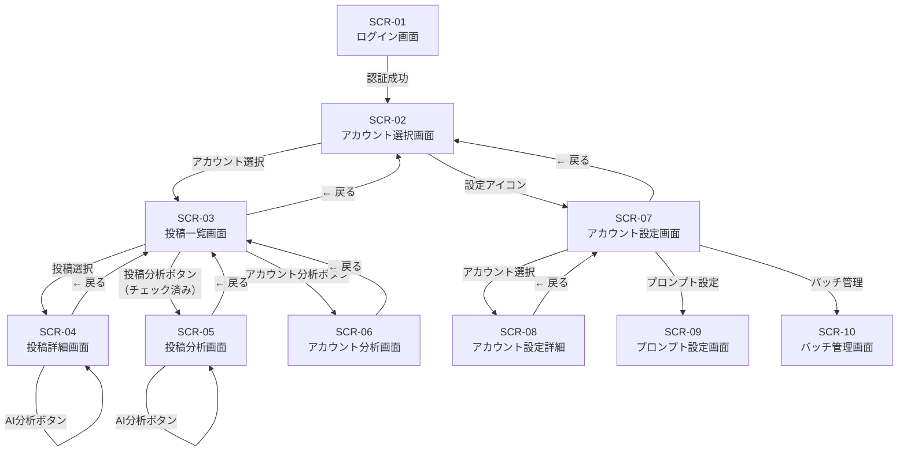

# Instagram分析システム 画面設計書

**バージョン**: 1.0
**作成日**: 2026-04-03
**フレームワーク**: Next.js 15 (App Router) / Vercel

---

## 1. 画面一覧

| 画面ID | 画面名 | URL | 説明 |
|--------|--------|-----|------|
| SCR-01 | ログイン画面 | `/auth/login` | Supabase Auth による認証 |
| SCR-02 | アカウント選択画面 | `/` | 管理アカウント一覧・トップページ |
| SCR-03 | 投稿一覧画面 | `/accounts/[id]/posts` | 選択アカウントの投稿一覧 |
| SCR-04 | 投稿詳細画面 | `/accounts/[id]/posts/[postId]` | 投稿の詳細・指標値 |
| SCR-05 | 投稿分析画面 | `/accounts/[id]/posts/analysis` | 複数投稿の比較グラフ分析 |
| SCR-06 | アカウント分析画面 | `/accounts/[id]/analysis` | アカウント全体分析 |
| SCR-07 | アカウント設定画面 | `/settings/accounts` | Instagramアカウントマスタ管理 |
| SCR-08 | アカウント設定詳細 | `/settings/accounts/[id]` | アカウント個別設定・KPI設定 |
| SCR-09 | プロンプト設定画面 | `/settings/prompts` | AI分析観点プロンプト設定 |
| SCR-10 | バッチ管理画面 | `/settings/batch` | バッチ実行状態・手動実行 |

---

## 2. 画面遷移図



---

## 3. 共通レイアウト

### グローバルナビゲーション（認証後全画面共通）

```
┌─────────────────────────────────────────────────────────────────┐
│ 🏠 Instagram分析        [アカウント名]          ⚙️ 設定  👤 ログアウト │
└─────────────────────────────────────────────────────────────────┘
```

- 左: ロゴ・ホームリンク
- 中央: 現在選択中のアカウント名（アカウント選択後に表示）
- 右: 設定メニュー、ログアウト

---

## 4. 各画面詳細仕様

---

### SCR-01: ログイン画面 `/auth/login`

#### レイアウト

```
┌────────────────────────────────┐
│                                │
│      🏠 Instagram分析ツール     │
│                                │
│   [メールアドレス           ]  │
│   [パスワード               ]  │
│                                │
│        [ログイン]              │
│                                │
└────────────────────────────────┘
```

#### 仕様

- Supabase Auth のメール/パスワード認証
- 認証後は `/` にリダイレクト
- セッションはSupabase の JWT で管理

---

### SCR-02: アカウント選択画面 `/`

#### レイアウト

```
┌─────────────────────────────────────────────────────────────────┐
│ 🏠 Instagram分析                              ⚙️ 設定  👤 ログアウト │
├─────────────────────────────────────────────────────────────────┤
│                                                                   │
│   管理アカウント                                                   │
│                                                                   │
│  ┌────────────┐  ┌────────────┐  ┌────────────┐                  │
│  │ [画像]     │  │ [画像]     │  │ [画像]     │                  │
│  │            │  │            │  │            │                  │
│  │ @account_A │  │ @account_B │  │ @account_C │                  │
│  │            │  │            │  │            │                  │
│  │ フォロワー │  │ フォロワー │  │ フォロワー │                  │
│  │ 12,500人  │  │ 8,200人   │  │ 3,100人   │                  │
│  │            │  │            │  │            │                  │
│  │ 最終同期   │  │ 最終同期   │  │ 最終同期   │                  │
│  │ 5分前      │  │ 1時間前    │  │ 3分前      │                  │
│  └────────────┘  └────────────┘  └────────────┘                  │
│                                                                   │
└─────────────────────────────────────────────────────────────────┘
```

#### 仕様

- 登録アカウントをカード形式で一覧表示
- カードに表示する情報: プロフィール画像、ユーザーネーム、フォロワー数、最終同期時刻
- カードクリック → SCR-03（投稿一覧画面）に遷移
- 同期状態インジケーター: 最終同期から1時間以内→緑、1〜6時間→黄、それ以上→赤
- 設定ボタンクリック → SCR-07（アカウント設定画面）に遷移

---

### SCR-03: 投稿一覧画面 `/accounts/[id]/posts`

#### レイアウト

```
┌─────────────────────────────────────────────────────────────────┐
│ 🏠 Instagram分析  [@account_A]                ⚙️ 設定  👤 ログアウト │
├─────────────────────────────────────────────────────────────────┤
│                                                                   │
│  ← アカウント選択に戻る                   [アカウント分析]        │
│                                                                   │
│  ┌──────────────────────────────────────────────────────────┐   │
│  │ [投稿分析（N件選択中）]  ← チェックがあると活性           │   │
│  │                                                           │   │
│  │  □ [画像] 2026/04/01  リーチ: 5,600  いいね: 234        │   │
│  │           春の新作コレクションが...                       │   │
│  │                                                           │   │
│  │  □ [画像] 2026/03/28  リーチ: 3,200  いいね: 156        │   │
│  │           週末のお出かけスポット...                       │   │
│  │                                                           │   │
│  │  □ [動画] 2026/03/25  リーチ: 8,900  いいね: 412        │   │
│  │  🎬       話題のカフェに行ってみた...                     │   │
│  │                                                           │   │
│  │  □ [リール] 2026/03/22  リーチ: 12,400  いいね: 890     │   │
│  │  ▶️        おすすめレシピ3選...                            │   │
│  │                                                           │   │
│  │  [さらに読み込む]                                         │   │
│  └──────────────────────────────────────────────────────────┘   │
│                                                                   │
└─────────────────────────────────────────────────────────────────┘
```

#### 仕様

- 投稿は `posted_at` の降順で表示（最新順）
- 表示項目（各行）: チェックボックス、サムネイル、投稿日時、リーチ数、いいね数、キャプション冒頭
- 投稿種別アイコン: 画像(なし)、動画(🎬)、カルーセル(⊞)、リール(▶️)、ストーリー(⏱)
- チェックボックス: 1件以上チェックで「投稿分析ボタン」が活性化
- 「投稿分析」ボタン: 選択件数を表示（例: `投稿分析（3件選択中）`）→ SCR-05へ
- 「アカウント分析」ボタン: SCR-06へ遷移
- 投稿行クリック → SCR-04へ遷移（チェックボックス以外の領域）
- 無限スクロール or 「さらに読み込む」ボタンでページネーション
- フィルター機能（後から追加可）: 投稿種別、期間

#### API

```
GET /api/accounts/{accountId}/posts
  Query: page, limit, order=posted_at_desc, type(FEED|REELS|VIDEO|STORY)
  Response: { posts: [], total: number, nextCursor: string }
```

---

### SCR-04: 投稿詳細画面 `/accounts/[id]/posts/[postId]`

#### レイアウト

```
┌─────────────────────────────────────────────────────────────────┐
│ 🏠 Instagram分析  [@account_A]                ⚙️ 設定  👤 ログアウト │
├─────────────────────────────────────────────────────────────────┤
│                                                                   │
│  ← 投稿一覧に戻る                              [AI分析]          │
│                                                                   │
│  ┌──────────────────┐   ┌────────────────────────────────────┐  │
│  │                  │   │ 投稿情報                            │  │
│  │  [投稿画像/      │   │ 投稿日時: 2026/04/01 12:00         │  │
│  │   動画サムネイル]│   │ 種別: リール                       │  │
│  │                  │   │                                    │  │
│  │  ← → （スライダー）│ │ キャプション:                      │  │
│  │                  │   │ 春の新作コレクションが到着しました  │  │
│  └──────────────────┘   │ ...続きを見る                      │  │
│                          │                                    │  │
│                          │ パーマリンク: [Instagramで見る]    │  │
│                          └────────────────────────────────────┘  │
│                                                                   │
│  指標値（最新スナップショット）                                    │
│  ┌──────────┬──────────┬──────────┬──────────┬──────────┐      │
│  │ リーチ   │いいね数  │ 保存数   │シェア数  │コメント数│      │
│  │  12,400  │   890    │   234    │   156    │    78    │      │
│  └──────────┴──────────┴──────────┴──────────┴──────────┘      │
│  ┌──────────┬──────────┬──────────┐                             │
│  │インプレッション│エンゲージメント率│ 保存率  │                   │
│  │  18,600  │   10.7%  │   1.9%  │                             │
│  └──────────┴──────────┴──────────┘                             │
│                                                                   │
│  ─────────────────────────────────────────────────────────────  │
│  AI分析結果                                                       │
│  ┌────────────────────────────────────────────────────────────┐ │
│  │ この投稿は保存率・シェア率ともに平均を上回っており...       │ │
│  │ （AI分析ボタン押下後に表示）                               │ │
│  └────────────────────────────────────────────────────────────┘ │
│                                                                   │
└─────────────────────────────────────────────────────────────────┘
```

#### 仕様

- 左カラム: 投稿メディア表示
  - カルーセルの場合: 左右矢印スライダーで複数画像を切り替え
  - 動画の場合: サムネイル画像を表示（再生は Instagramリンク）
- 右カラム: 投稿メタ情報
- 指標値カード: KPIマスタの `subject_level = 'media'` の値を表示
- 「AI分析」ボタン:
  - 押下 → ローディング表示
  - `POST /api/accounts/{id}/posts/{postId}/ai-analysis` を呼び出し
  - 結果を画面下部に表示（マークダウンレンダリング）
  - 分析結果は `ai_analysis_results` に保存し、再度開いた時は最新分析結果を表示

#### API

```
GET  /api/accounts/{accountId}/posts/{postId}
  Response: { post, latestInsights, latestAiAnalysis }

POST /api/accounts/{accountId}/posts/{postId}/ai-analysis
  Response: { analysisResult: string, analysisId: string }
```

---

### SCR-05: 投稿分析画面 `/accounts/[id]/posts/analysis`

#### レイアウト

```
┌─────────────────────────────────────────────────────────────────┐
│ 🏠 Instagram分析  [@account_A]                ⚙️ 設定  👤 ログアウト │
├─────────────────────────────────────────────────────────────────┤
│                                                                   │
│  ← 投稿一覧に戻る                              [AI分析（比較）]  │
│                                                                   │
│  表示指標: [☑リーチ] [☑いいね] [□保存] [□シェア] [□コメント]  │
│           [□インプレッション] [□エンゲージメント率] [□保存率]   │
│                                                                   │
│  時間軸: [1時間] [12時間] [1日]                                 │
│                                                                   │
│  ┌────────────────────┐  ┌────────────────────┐  ┌──────────────┐│
│  │ 投稿 2026/04/01    │  │ 投稿 2026/03/28    │  │ 投稿 ...    ││
│  │ [折れ線グラフ]     │  │ [折れ線グラフ]     │  │ [グラフ]    ││
│  │ ── リーチ         │  │                    │  │             ││
│  │ ── いいね         │  │                    │  │             ││
│  └────────────────────┘  └────────────────────┘  └──────────────┘│
│  ┌────────────────────┐                                           │
│  │ 投稿 2026/03/25    │  ← 4件目以降は折り返して縦に並ぶ         │
│  │ [折れ線グラフ]     │                                           │
│  └────────────────────┘                                           │
│                                                                   │
│  ── [投稿内容] [指標値] ──────────────────────────────────────  │
│                                                                   │
│  [投稿内容タブ選択時]                                             │
│  ┌───────────┐  ┌───────────┐  ┌───────────┐                    │
│  │投稿1の画像│  │投稿2の画像│  │投稿3の画像│                    │
│  │投稿日時   │  │投稿日時   │  │投稿日時   │                    │
│  │キャプション│  │キャプション│  │キャプション│                    │
│  └───────────┘  └───────────┘  └───────────┘                    │
│                                                                   │
│  [指標値タブ選択時]                                               │
│  時刻 | リーチ | いいね | ...（テーブル形式）                    │
│                                                                   │
└─────────────────────────────────────────────────────────────────┘
```

#### 仕様

**グラフ表示:**
- グラフ横幅は最大3列（4件以降は折り返して縦に積む）
- グラフライブラリ: Recharts（Next.js 対応、SSR可）
- 横軸: 時間軸（選択した粒度で表示）
- 縦軸: 指標値（複数指標は左右2軸まで）
- 凡例: 指標ごとに色分け（最大8色）

**時間軸切り替え:**

| 設定 | 表示範囲 | 横軸ラベル |
|------|---------|-----------|
| 1時間 | 投稿後72時間分 | `MM/DD HH:mm` |
| 12時間 | 投稿後30日分 | `MM/DD HH時` |
| 1日 | 投稿後90日分 | `MM/DD` |

**表示指標チェックボックス:**

| 指標 | デフォルト | 対象 |
|------|-----------|------|
| リーチ | ☑ | 全種別 |
| いいね | ☑ | FEED/REELS |
| 保存 | □ | FEED/REELS |
| シェア | □ | FEED/REELS |
| コメント | □ | FEED/REELS |
| インプレッション | □ | 全種別 |
| エンゲージメント率 | □ | FEED/REELS |
| 保存率 | □ | FEED/REELS |

**タブ仕様:**

- 「投稿内容」タブ: 選択投稿を最大3列で横並び表示
  - 各投稿カード: 投稿日時、メディア画像（カルーセルはスライダー）、キャプション全文
- 「指標値」タブ: スナップショット時刻ごとの指標値テーブル
  - 列: 時刻、選択中の各指標値

**AI分析（比較）ボタン:**
- 選択した複数投稿を比較する分析を実行
- `POST /api/accounts/{id}/posts/ai-analysis-comparison`
- 結果をモーダルまたは画面下部に表示

#### API

```
GET  /api/accounts/{accountId}/posts/analysis
  Query: postIds[]=xxx&postIds[]=yyy, grain=hourly|12h|daily
  Response: { posts: [{ post, snapshots: [{time, metrics}] }] }

POST /api/accounts/{accountId}/posts/ai-analysis-comparison
  Body: { postIds: string[] }
  Response: { analysisResult: string }
```

---

### SCR-06: アカウント分析画面 `/accounts/[id]/analysis`

#### レイアウト

```
┌─────────────────────────────────────────────────────────────────┐
│ 🏠 Instagram分析  [@account_A]                ⚙️ 設定  👤 ログアウト │
├─────────────────────────────────────────────────────────────────┤
│                                                                   │
│  ← 投稿一覧に戻る                                                │
│                                                                   │
│  ┌──────────────────────────────────────────────────────────┐   │
│  │ [画像]  @account_A  フォロワー: 12,500  フォロー: 380    │   │
│  │ 春の新作ファッションをお届け...                           │   │
│  │ 最終同期: 2026/04/03 14:30                               │   │
│  └──────────────────────────────────────────────────────────┘   │
│                                                                   │
│  KPIサマリー（当月）                                              │
│  ┌────────┬────────┬────────┬────────┐                          │
│  │フォロワー増加│エンゲージメント率│月間リーチ│投稿数│          │
│  │ +234   │  4.5%  │ 89,200 │  14   │                          │
│  │目標: +500│目標: 5.0%│目標: 100K│目標: 16│                    │
│  │ 46.8%  │ 90.0%  │ 89.2%  │ 87.5% │  ← 達成率              │
│  └────────┴────────┴────────┴────────┘                          │
│                                                                   │
│  ── [週間分析履歴] [月間分析履歴] ──────────────────────────── │
│                                                                   │
│  [週間分析履歴タブ]                                              │
│                                                                   │
│  ▼ 2026年第13週 (03/27 - 04/02)  ★ 評価: B+                   │
│  ┌────────────────────────────────────────────────────────────┐ │
│  │ 今週はリールの保存率が先週比+23%と大きく改善しました。     │ │
│  │ 一方でフォロワー増加数は目標の46.8%にとどまっており、      │ │
│  │ CTAの改善が必要と考えられます...                           │ │
│  └────────────────────────────────────────────────────────────┘ │
│                                                                   │
│  ▶ 2026年第12週 (03/20 - 03/26)  ★ 評価: B                    │
│  ▶ 2026年第11週 (03/13 - 03/19)  ★ 評価: C+                   │
│                                                                   │
└─────────────────────────────────────────────────────────────────┘
```

#### 仕様

**アカウント情報:**
- プロフィール画像、ユーザーネーム、フォロワー数、フォロー数、投稿数
- 自己紹介テキスト
- 最終同期日時

**KPIサマリーカード:**
- `account_kpi_settings` から目標値を取得
- `kpi_progress` から達成率を取得
- 達成率の色分け: 100%以上→緑、70%以上→黄、70%未満→赤

**分析履歴タブ:**
- アコーディオン形式で過去の分析結果を表示
- 週間: `ai_analysis_results` の `analysis_type = 'account_weekly'` を新しい順
- 月間: `ai_analysis_results` の `analysis_type = 'account_monthly'` を新しい順
- 各エントリに「評価ラベル」（AI分析結果からパース or バッチ時に計算）

#### API

```
GET /api/accounts/{accountId}/analysis
  Response: {
    account: {},
    kpiSummary: [{ kpi, actual, target, achievementRate }],
    weeklyHistory: [{ period, analysisResult, rating, createdAt }],
    monthlyHistory: [{ period, analysisResult, rating, createdAt }]
  }
```

---

### SCR-07: アカウント設定画面 `/settings/accounts`

#### レイアウト

```
┌─────────────────────────────────────────────────────────────────┐
│ 🏠 Instagram分析                              ⚙️ 設定  👤 ログアウト │
├─────────────────────────────────────────────────────────────────┤
│                                                                   │
│  ← ホームに戻る                          [新規アカウント追加]   │
│                                                                   │
│  設定メニュー                                                     │
│  [Instagramアカウント] [プロンプト設定] [バッチ管理]             │
│                                                                   │
│  登録済みアカウント一覧                                           │
│                                                                   │
│  ┌──────────────────────────────────────────────────────────┐   │
│  │ [画像] @account_A  ビジネスアカウント  ● 接続中          │   │
│  │        フォロワー: 12,500  最終同期: 5分前              [編集]│
│  ├──────────────────────────────────────────────────────────┤   │
│  │ [画像] @account_B  クリエイターアカウント  ● 接続中      │   │
│  │        フォロワー: 8,200  最終同期: 1時間前             [編集]│
│  ├──────────────────────────────────────────────────────────┤   │
│  │ [画像] @account_C  ビジネスアカウント  ⚠ トークン期限   │   │
│  │        フォロワー: 3,100  最終同期: 2日前               [編集]│
│  └──────────────────────────────────────────────────────────┘   │
│                                                                   │
└─────────────────────────────────────────────────────────────────┘
```

#### 仕様

- アカウント一覧: 登録済みアカウントを表示
- 接続状態インジケーター: ● 接続中（緑）/ ⚠ トークン期限（黄）/ ✕ 切断（赤）
- 「新規アカウント追加」→ SCR-08（新規）へ
- 「編集」→ SCR-08（編集）へ

---

### SCR-08: アカウント設定詳細 `/settings/accounts/[id]`

#### レイアウト

```
┌─────────────────────────────────────────────────────────────────┐
│ 🏠 Instagram分析                              ⚙️ 設定  👤 ログアウト │
├─────────────────────────────────────────────────────────────────┤
│                                                                   │
│  ← アカウント設定に戻る                                          │
│                                                                   │
│  ── [基本情報] [API設定] [KPI設定] [戦略設定] ──────────────── │
│                                                                   │
│  [基本情報タブ]                                                   │
│  Instagramユーザーネーム: [@account_A          ]                 │
│  アカウント種別:  [● ビジネス  ○ クリエイター]                 │
│  表示順:  [1 ▲▼]                                               │
│  ステータス:  [● 有効  ○ 停止]                                 │
│                                                                   │
│  [API設定タブ]                                                    │
│  Instagram ビジネスアカウントID:                                  │
│  [                              ]                                │
│  Facebook ページID:                                              │
│  [                              ]                                │
│  アクセストークン:                                                │
│  [••••••••••••••••••••••••••••  ] [更新]                        │
│  トークン有効期限: 2026/06/01（残り59日）                        │
│  スコープ: instagram_business_basic, instagram_business_manage_insights │
│                                                                   │
│  [KPI設定タブ]                                                    │
│  目標フォロワー数:      [    10,000 ] 人                         │
│  目標エンゲージメント率: [      5.0 ] %                          │
│  目標リーチ数/投稿:     [    5,000 ] 人                          │
│  目標保存数/投稿:       [      100 ] 回                          │
│  目標投稿頻度:          [      7.0 ] 回/週                       │
│  月間フォロワー純増目標: [      500 ] 人/月                      │
│                                                                   │
│  [戦略設定タブ]                                                   │
│  アカウント戦略:                                                  │
│  ┌────────────────────────────────────────────────────────────┐ │
│  │ ターゲット: 20〜30代女性                                    │ │
│  │ コンセプト: 日常のおしゃれを手軽に楽しむライフスタイル提案  │ │
│  │ 注力コンテンツ: リール（ハウツー系）、カルーセル（比較系）  │ │
│  └────────────────────────────────────────────────────────────┘ │
│                                                                   │
│                          [保存]  [削除]                          │
│                                                                   │
└─────────────────────────────────────────────────────────────────┘
```

#### 仕様

**基本情報タブ:** アカウント基本情報の編集

**API設定タブ:**
- アクセストークンは `•` でマスク表示
- 「更新」ボタン: トークンの手動更新（有効期限確認・再取得）
- 接続テストボタン: APIへの疎通確認

**KPI設定タブ:**
- 数値入力フィールド（未入力 = KPI評価から除外）
- 入力値は `account_kpi_settings` に保存

**戦略設定タブ:**
- 自由記述テキストエリア
- `account_strategy_settings` に保存
- AI分析時に自動でプロンプトに付加

#### API

```
GET    /api/settings/accounts/{id}
POST   /api/settings/accounts                (新規)
PUT    /api/settings/accounts/{id}           (更新)
DELETE /api/settings/accounts/{id}           (削除)
POST   /api/settings/accounts/{id}/test-connection  (接続テスト)
```

---

### SCR-09: プロンプト設定画面 `/settings/prompts`

#### レイアウト

```
┌─────────────────────────────────────────────────────────────────┐
│ 🏠 Instagram分析                              ⚙️ 設定  👤 ログアウト │
├─────────────────────────────────────────────────────────────────┤
│                                                                   │
│  ← 設定に戻る                                                    │
│                                                                   │
│  ── [投稿分析] [投稿比較分析] [週次分析] [月次分析] ──────────  │
│                                                                   │
│  [投稿分析タブ]                                                   │
│  分析観点プロンプト（投稿単体の分析に使用）                        │
│                                                                   │
│  ┌────────────────────────────────────────────────────────────┐ │
│  │ 以下の観点でInstagram投稿を分析してください：              │ │
│  │                                                            │ │
│  │ 1. エンゲージメントの質（保存率・シェア率を重視）          │ │
│  │ 2. リーチ効率（フォロワー外への波及度）                    │ │
│  │ 3. 投稿タイプ別のパフォーマンス比較                        │ │
│  │ 4. 改善提案（次回投稿へのアクション）                      │ │
│  └────────────────────────────────────────────────────────────┘ │
│                                                                   │
│  Instagramアルゴリズム情報                                        │
│  最終取得: 2026/03/15 09:00   [最新アルゴリズム取得]            │
│  ┌────────────────────────────────────────────────────────────┐ │
│  │ 2026年3月時点のInstagramアルゴリズム情報：                 │ │
│  │ - Reels: 視聴完了率と保存率を最重視...                    │ │
│  │ - フィード: エンゲージメント速度（初速）が重要...          │ │
│  └────────────────────────────────────────────────────────────┘ │
│                                  [分析観点に追記]  [保存]        │
│                                                                   │
└─────────────────────────────────────────────────────────────────┘
```

#### 仕様

**プロンプト設定タブ（4種類）:**

| タブ | prompt_type | 用途 |
|-----|------------|------|
| 投稿分析 | `post_analysis` | SCR-04のAI分析ボタン |
| 投稿比較分析 | `post_comparison` | SCR-05のAI分析ボタン |
| 週次分析 | `account_weekly` | 週次バッチ |
| 月次分析 | `account_monthly` | 月次バッチ |

**「最新アルゴリズム取得」ボタン:**
- Claude API + Web検索でInstagramの最新アルゴリズム情報を取得
- 取得結果をアルゴリズム情報エリアに表示（プロンプト本文には自動追記しない）
- 「分析観点に追記」ボタンでプロンプト本文の末尾に追記

#### API

```
GET  /api/settings/prompts
  Response: { prompts: [{ promptType, promptText, algorithmInfo, algorithmFetchedAt }] }

PUT  /api/settings/prompts/{promptType}
  Body: { promptText: string }

POST /api/settings/prompts/fetch-algorithm
  Response: { algorithmInfo: string, fetchedAt: string }
```

---

### SCR-10: バッチ管理画面 `/settings/batch`

#### レイアウト

```
┌─────────────────────────────────────────────────────────────────┐
│ 🏠 Instagram分析                              ⚙️ 設定  👤 ログアウト │
├─────────────────────────────────────────────────────────────────┤
│                                                                   │
│  ← 設定に戻る                                                    │
│                                                                   │
│  バッチ実行状態                                                   │
│                                                                   │
│  ┌─────────────────────────────────────────────────────────┐    │
│  │ バッチ名               最終実行   状態   実行時間  操作  │    │
│  ├─────────────────────────────────────────────────────────┤    │
│  │ media_index_batch     14:00      ✅成功  12秒    [実行]  │    │
│  │ media_insight_batch   14:10      ✅成功  45秒    [実行]  │    │
│  │ account_insight_batch 04:00      ✅成功  8秒     [実行]  │    │
│  │ story_insight_batch   13:30      ✅成功  6秒     [実行]  │    │
│  │ kpi_calc_batch        14:30      ✅成功  18秒    [実行]  │    │
│  │ ai_weekly_batch       03/31      ✅成功  38秒    [実行]  │    │
│  │ token_refresh_batch   03:00      ⚠一部  22秒    [実行]  │    │
│  └─────────────────────────────────────────────────────────┘    │
│                                                                   │
│  バッチ実行ログ（直近20件）                                       │
│  ┌─────────────────────────────────────────────────────────┐    │
│  │ 14:30:05 kpi_calc_batch 成功 処理件数:45 時間:18s        │    │
│  │ 14:10:08 media_insight_batch 成功 処理件数:12 時間:45s   │    │
│  │ 14:00:03 media_index_batch 成功 処理件数:3 時間:12s      │    │
│  │ 13:30:04 story_insight_batch 成功 処理件数:5 時間:6s     │    │
│  └─────────────────────────────────────────────────────────┘    │
│                                                                   │
└─────────────────────────────────────────────────────────────────┘
```

#### 仕様

- バッチ一覧: 全バッチの最終実行時刻・状態・実行時間を表示
- 状態アイコン: ✅ 成功 / ⚠ 一部失敗 / ❌ 失敗 / ⏳ 実行中
- 「実行」ボタン: バッチを手動で即時実行（管理者のみ）
- ログエリア: 直近20件のバッチ実行ログをリアルタイム表示

#### API

```
GET  /api/settings/batch/status
  Response: { batches: [{ jobName, lastRunAt, status, durationMs }] }

GET  /api/settings/batch/logs
  Query: limit=20
  Response: { logs: [{ jobName, status, recordsProcessed, startedAt, durationMs }] }

POST /api/settings/batch/{jobName}/run
  Response: { jobId: string, startedAt: string }
```

---

## 5. Next.js App Router ディレクトリ構成

```
app/
├── auth/
│   └── login/
│       └── page.tsx                    # SCR-01
├── (dashboard)/                        # 認証済みレイアウトグループ
│   ├── layout.tsx                      # グローバルナビ共通レイアウト
│   ├── page.tsx                        # SCR-02 アカウント選択
│   ├── accounts/
│   │   └── [accountId]/
│   │       ├── posts/
│   │       │   ├── page.tsx            # SCR-03 投稿一覧
│   │       │   ├── analysis/
│   │       │   │   └── page.tsx        # SCR-05 投稿分析
│   │       │   └── [postId]/
│   │       │       └── page.tsx        # SCR-04 投稿詳細
│   │       └── analysis/
│   │           └── page.tsx            # SCR-06 アカウント分析
│   └── settings/
│       ├── accounts/
│       │   ├── page.tsx                # SCR-07 アカウント設定一覧
│       │   ├── new/
│       │   │   └── page.tsx            # SCR-08 新規アカウント追加
│       │   └── [accountId]/
│       │       └── page.tsx            # SCR-08 アカウント設定詳細
│       ├── prompts/
│       │   └── page.tsx                # SCR-09 プロンプト設定
│       └── batch/
│           └── page.tsx                # SCR-10 バッチ管理
├── api/                                # API Routes
│   ├── accounts/
│   │   ├── route.ts                    # GET(一覧), POST(新規)
│   │   └── [accountId]/
│   │       ├── route.ts                # GET, PUT, DELETE
│   │       ├── posts/
│   │       │   ├── route.ts            # GET 投稿一覧
│   │       │   ├── analysis/
│   │       │   │   └── route.ts        # GET グラフデータ, POST AI比較分析
│   │       │   └── [postId]/
│   │       │       ├── route.ts        # GET 投稿詳細
│   │       │       └── ai-analysis/
│   │       │           └── route.ts    # POST AI分析
│   │       └── analysis/
│   │           └── route.ts            # GET アカウント分析
│   └── settings/
│       ├── accounts/
│       │   └── [accountId]/
│       │       └── test-connection/
│       │           └── route.ts
│       ├── prompts/
│       │   ├── route.ts                # GET, PUT
│       │   └── fetch-algorithm/
│       │       └── route.ts            # POST
│       └── batch/
│           ├── status/
│           │   └── route.ts
│           ├── logs/
│           │   └── route.ts
│           └── [jobName]/
│               └── run/
│                   └── route.ts
└── middleware.ts                        # 認証ミドルウェア
```

---

## 6. API一覧（全エンドポイント）

| Method | Path | 説明 | 使用画面 |
|--------|------|------|---------|
| GET | `/api/accounts` | アカウント一覧 | SCR-02, SCR-07 |
| POST | `/api/accounts` | アカウント新規登録 | SCR-08 |
| GET | `/api/accounts/{id}` | アカウント詳細 | SCR-08 |
| PUT | `/api/accounts/{id}` | アカウント更新 | SCR-08 |
| DELETE | `/api/accounts/{id}` | アカウント削除 | SCR-08 |
| POST | `/api/accounts/{id}/test-connection` | 接続テスト | SCR-08 |
| GET | `/api/accounts/{id}/posts` | 投稿一覧 | SCR-03 |
| GET | `/api/accounts/{id}/posts/{postId}` | 投稿詳細 | SCR-04 |
| POST | `/api/accounts/{id}/posts/{postId}/ai-analysis` | 投稿AI分析 | SCR-04 |
| GET | `/api/accounts/{id}/posts/analysis` | 投稿比較グラフデータ | SCR-05 |
| POST | `/api/accounts/{id}/posts/ai-analysis-comparison` | 投稿比較AI分析 | SCR-05 |
| GET | `/api/accounts/{id}/analysis` | アカウント分析データ | SCR-06 |
| GET | `/api/settings/prompts` | プロンプト設定取得 | SCR-09 |
| PUT | `/api/settings/prompts/{type}` | プロンプト設定更新 | SCR-09 |
| POST | `/api/settings/prompts/fetch-algorithm` | アルゴリズム情報取得 | SCR-09 |
| GET | `/api/settings/batch/status` | バッチ状態取得 | SCR-10 |
| GET | `/api/settings/batch/logs` | バッチログ取得 | SCR-10 |
| POST | `/api/settings/batch/{jobName}/run` | バッチ手動実行 | SCR-10 |

---

## 7. 主要コンポーネント設計

```
components/
├── ui/                          # 汎用UIコンポーネント
│   ├── Button.tsx
│   ├── Card.tsx
│   ├── Modal.tsx
│   ├── Tabs.tsx
│   ├── Checkbox.tsx
│   ├── Badge.tsx
│   └── LoadingSpinner.tsx
├── layout/
│   ├── GlobalNav.tsx            # グローバルナビゲーション
│   └── PageHeader.tsx           # ページヘッダー（戻るボタン等）
├── accounts/
│   ├── AccountCard.tsx          # アカウント選択カード
│   └── AccountStatusBadge.tsx   # 接続状態バッジ
├── posts/
│   ├── PostListItem.tsx         # 投稿一覧の各行
│   ├── PostMediaSlider.tsx      # カルーセルスライダー
│   └── PostMetricsCard.tsx      # 指標値カード
├── charts/
│   ├── InsightLineChart.tsx     # 折れ線グラフ（Recharts）
│   └── MetricSelector.tsx      # 指標チェックボックス
├── kpi/
│   ├── KpiSummaryCard.tsx       # KPIサマリーカード
│   └── KpiProgressBar.tsx       # 達成率プログレスバー
└── analysis/
    ├── AiAnalysisButton.tsx     # AI分析ボタン（ローディング付き）
    ├── AiAnalysisResult.tsx     # AI分析結果表示
    └── AnalysisHistoryItem.tsx  # 分析履歴アイテム
```
