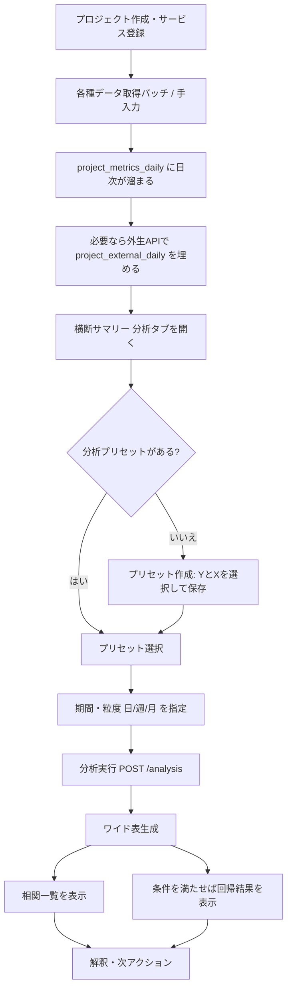

# プロジェクト横断サマリー「分析」機能ガイド

本ドキュメントは、**実装済み**の分析機能（`/projects/[projectId]/unified-summary` の **分析タブ**、`POST /api/projects/[projectId]/analysis`）の挙動を、業務フローとデータの流れで整理したものです。

---

## 1. できる分析の一覧

現状、**1回の「分析実行」でまとめて次の2種類**が計算されます（別ボタンではなく同じAPIレスポンス内）。

| # | 分析名 | 概要 | 出力イメージ |
| --- | --- | --- | --- |
| A | **ピアソンの相関（ペアワイズ）** | プリセットで選んだ **Y と全ての X**、および **X同士** の組み合わせについて、時系列上で **両方とも値がある日（または週・月バケット）だけ**を使って相関係数 \(r\) を算出 | 相関行列風の一覧（`col1`, `col2`, `r`, 有効ペア数 `n`） |
| B | **線形回帰（OLS・最小二乗）** | **Y（目的変数）1つ** と **X（説明変数）複数** に対し、\(Y = b_0 + b_1 X_1 + \\cdots + b_k X_k\) を **リストワイズ削除**（Y またはいずれかの X が欠損の行は捨てる）で推定 | 切片、各Xの係数、\(R^2\)、有効観測数 `n` |

### 補足: KPIツリーは「分析手法」か？

**厳密には別物**です。

- **KPIツリー**（`project_kpi_tree_nodes`）: 指標の**階層・メモ・整理用**のUI。DnDで並べ替え・フォルダ/リーフ・リーフに「どのサービスのどの指標か」を紐づけられる。
- **分析の計算本体**は **分析プリセット**（`project_analysis_presets`）の **Y / X の列キー** と、**分析実行API** が担当。

現状、**ツリーのノードを自動で回帰に流し込む連携は必須ではなく**、実務上は **プリセットで Y/X を明示**して実行する想定です（ツリーは意思決定・共有用の整理ツリーとして使う）。

---

## 2. 各分析に渡すデータとは何か

すべての分析の入力は、次の共通形に集約されます。

### 2.1 列キー（`metric_ref` の実体）

| 種類 | 列キーの形式 | 例 |
| --- | --- | --- |
| サービス別指標 | `{serviceId}::{metricRef}` | `a1b2c3...::google_ads_campaign_daily.cost_micros` |
| 外生変数 | `external.{フィールド名}` | `external.temperature_max`, `external.is_holiday` |

- `serviceId` … `services.id`（プロジェクト内のアクティブサービス）
- `metricRef` … サマリー指標カタログの ID（例: `table.field` 形式が多い）

### 2.2 分析APIに渡すJSON（`POST /api/projects/[projectId]/analysis`）

| フィールド | 必須 | 意味 |
| --- | --- | --- |
| `targetMetricRef` | はい | **Y**（1列・上記列キー） |
| `featureMetricRefs` | はい（1個以上） | **X** の配列（最大20個） |
| `startDate` | はい | 期間開始 `YYYY-MM-DD` |
| `endDate` | はい | 期間終了 `YYYY-MM-DD` |
| `timeUnit` | 任意（既定 `day`） | `day` / `week` / `month` |

**相関**は `targetMetricRef` と `featureMetricRefs` に含まれる **すべての列のペア**（自分自身含む）について計算されます。  
**回帰**は `targetMetricRef` を Y、`featureMetricRefs` を X に使います。

---

## 3. システム上、データはどう作られるか（手順）

分析結果の質は **「ワイド表が正しく埋まっているか」**に依存します。流れは次のとおりです。

### ステップ0: 前提（プロジェクト・サービス）

1. プロジェクトが存在する。
2. 対象サービスが **論理削除されていない**（`deleted_at IS NULL`）。
3. （天気を使う場合）プロジェクトに **緯度経度** が入っていると、`project_external_daily` の取得がしやすい（外生APIの仕様に依存）。

### ステップ1: 日次指標キャッシュ `project_metrics_daily`

- **バッチ**: `GET/POST /api/batch/project-metrics-aggregate`（Vercel Cron 例: 毎日）
- **内容**: 各サービスについて、指標カタログに載る **各 `metric_ref` を1日1行**で `value` としてUPSERT。
- **意味**: 分析APIは主にここから **日次の数値列**を読み、`serviceId::metricRef` ごとにピボットしてワイド表を作る。

**注意**: キャッシュが無い日は分析の **その列・その日は欠損**になります。UIでは「バッチを実行して蓄積」と案内されることがあります。

### ステップ2: 外生変数 `project_external_daily`

- **取得**: `GET /api/projects/[projectId]/unified-summary/external?from=&to=` が、欠損日を **オンデマンドで取得してUPSERT**（祝日ロジック＋天気API等）。
- **分析での利用**: 分析APIが `external.*` 列を要求したとき、`project_external_daily` を **日付キーで結合**し、ワイド表にマージする。

### ステップ3: 画面側の「指標候補」

- `GET /api/projects/[projectId]/unified-summary/config` が、プロジェクト内アクティブサービスごとに **利用可能指標カタログ**を返す。
- 分析タブではこれを **`{serviceId}::{metric.id}`** に展開し、さらに **外生**用の固定候補（`external.is_holiday` 等）を足す。

### ステップ4: 分析プリセット `project_analysis_presets`

- ユーザーが **名前・Y・X複数** を保存。
- 「分析実行」時は、選んだプリセットの Y/X が **そのまま** `POST /analysis` のボディになる。

### ステップ5: ワイド表の組み立て（分析API内部）

1. `allRefs = [Y, ...X]` をユニーク化の前提で列集合にする。
2. `project_metrics_daily` から `project_id`・期間・該当 `service_id` / `metric_ref` だけ取得し、**日付 → 列キー → 値** のマップを作る。
3. `external.*` が含まれる場合、`project_external_daily` を同じ日付でマージ（`is_holiday` は 0/1）。
4. `timeUnit` が `week` / `month` のとき、日次マップを **バケット**（週=月曜始まりの週キー、月=YYYY-MM）に集約する。  
   - 列ごとに **sum / avg / last** の簡易ルール（費用・クリック等は合計、率系は平均、フォロワー数等は期間内最終日など）。  
   - このルールは **警告文**としてレスポンスに含まれることがある。

### ステップ6: 相関・回帰

- 日付（またはバケット）を昇順に並べ、各列を **ベクトル**化。
- **相関**: 列ペアごとに、両方非欠損のペア数が十分あれば Pearson \(r\)。
- **回帰**: リストワイズ削除後の行数 `n` が閾値未満、または説明変数の数との関係で不安定なとき **回帰はスキップ**され、警告が付く。

---

## 4. 分析業務全体のフロー（おすすめの順番）

「何が起きて、どうなるか」を **時系列**で整理します。

### 各工程で「何が起きるか」

| 順 | 工程 | 起きること | 得られるもの |
| --- | --- | --- | --- |
| 1 | サービス運用・バッチ | 広告・SNS・LP等の生データがDBに入り、`project-metrics-aggregate` が **前日分をキャッシュ** | **日次の数値列**（サービス×指標） |
| 2 | 外生の準備 | プロジェクト位置情報や `unified-summary/external` の呼び出しで **祝日・天気**が日付単位で揃う | **外生列**（分析のXに使える） |
| 3 | プリセット設計 | 「この売上（Y）を、どのチャネル・外生（X）で説明したいか」を固定 | **再現可能な分析の入力セット** |
| 4 | 実行 | APIが **ワイド表→相関→回帰** を一括計算 | **相関の全体像**＋**単一の線形モデル** |
| 5 | 解釈 | 相関は「動きが似ている」、回帰は「同時期に他を固定したときの近似」**に過ぎない**（因果ではない） | 仮説・追加データ要否・施策優先のたたき台 |

### KPIツリーをどこに置くか（任意）

| タイミング | やること | 効果 |
| --- | --- | --- |
| プリセットの前後 | フォルダ「新規獲得」「リピート」などを作り、リーフに代表指標をぶら下げる | **社内での指標の地図**ができる（分析APIへの自動入力は現状必須ではない） |
| プリセットとセット | プリセット名とツリーの枝の名前を揃える運用 | **「どの問いのためのプリセットか」**が伝わりやすい |

---

## 5. 制限・注意（MVPとして読んでおくべきこと）

- **相関 ≠ 因果**、**回帰も因果認定には使えない**（社内向けでも解釈は慎重に）。
- **観測数が少ない**と相関・回帰は不安定。APIは **警告**を返すことがある。
- **週次・月次**はルールベース集約であり、指標の意味によっては **合計が正しい／最終日が正しい**等、別定義が望ましい場合がある（レスポンスの warnings を確認）。
- **カスタム指標**（`service_custom_metrics`）を分析列に含めるには、その値が **`project_metrics_daily` に載るパイプライン**に乗っている必要がある（カタログとバッチの対象外だと欠損のまま）。

---

## 6. 関連コード・ドキュメント

| 内容 | パス |
| --- | --- |
| 分析API | `src/app/api/projects/[projectId]/analysis/route.ts` |
| 分析UI | `src/app/(dashboard)/projects/[projectId]/unified-summary/_components/AnalysisTab.tsx` |
| 日次集計バッチ | `src/app/api/batch/project-metrics-aggregate/route.ts` |
| 外生取得 | `src/app/api/projects/[projectId]/unified-summary/external/route.ts` |
| プリセットAPI | `src/app/api/projects/[projectId]/analysis-presets/` |
| KPIツリーAPI | `src/app/api/projects/[projectId]/kpi-tree/nodes/` |
| Phase E 仕様メモ | `docs/project-kpi-tree-phase-e.md` |

---

## 7. 改訂履歴

| 日付 | 内容 |
| --- | --- |
| 2026-04-13 | 初版（実装に合わせて記述） |
